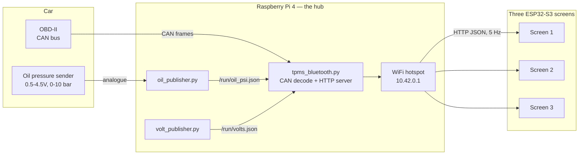

# 370Z Telemetry — how it works

A set of round touchscreen gauges for a 2015 Nissan 370Z, showing data the
factory dash does not: oil pressure, oil temperature, individual tyre pressures,
battery voltage and cornering G.

Everything is read from the car itself. Nothing is guessed, and nothing needs
the car modified beyond an OBD tap and one sensor.

---

## The shape of it



One Pi does all the reading and decoding. The screens are dumb clients: they ask
for a JSON document several times a second and draw it. That split is the single
most important design decision — see *Why it is built this way* below.

---

## Hardware

### The hub
| Part | Role |
|---|---|
| **Raspberry Pi 4** | Reads CAN and sensors, serves the data, runs the WiFi hotspot |
| **CAN HAT (MCP2515)** | OBD-II CAN interface |
| **Pimoroni ADS1015 breakout** | Battery voltage, ±24V, I²C 0x48 |
| **M5Stack voltmeter unit** | Oil pressure sender ADC, I²C 0x49 |

Both I²C devices share one bus — they are told apart by address.

### The gauges
| Part | Role |
|---|---|
| **3 × Waveshare ESP32-S3-Touch-LCD-2.1** | 480×480 round touchscreens, WiFi |
| **12V→5V buck converter, 5A** | One switched-ignition supply for all three |

Each board carries its own extras used by the firmware: a **QMI8658
accelerometer**, which is what produces the G-force display, a PCF85063
real-time clock, and a capacitive touch panel.

### The one added sensor
An **oil pressure sender** (0.5–4.5V over 0–10 bar) plumbed into the engine.
Everything else is read passively from data the car already produces.

---

## Connections

```
OBD-II port ──┬── pin 6/14 (CAN H/L) ──── CAN HAT ──── Pi 4
              └── pin 4/5  (ground)

oil sender ─── M5Stack voltmeter ──┐
                                   ├── I²C (SDA/SCL) ── Pi 4
switched 12V ── ADS1015 breakout ──┘

switched 12V ── fuse ── buck 12V→5V ─┬── screen 1
                                     ├── screen 2
                                     └── screen 3   (star wiring, not daisy-chain)

Pi 4 hotspot 10.42.0.1  ~~WiFi~~  screens 10.42.0.x
```

The screens have **no wired connection to the car at all** beyond power. They
join the Pi's WiFi and pull data over HTTP, so a screen can be moved or added
without touching the loom.

---

## Where the data comes from

### Read straight off the CAN bus
| Data | CAN ID | Notes |
|---|---|---|
| Tyre pressures | `0x385` | bytes 2–5 ÷ 4 = psi, in the order RR, FR, RL, FL |
| Engine RPM | `0x180` | bytes 0:1 big-endian ÷ 8 |
| Oil temperature | `0x580` | byte 4 − 50 = °C |
| Coolant temperature | `0x551` | byte 0 × 1.25 − 69 = °C |
| Road speed | `0x355` | bytes 0:1 big-endian |
| Gear | `0x421` | 0x80 = 1st, +8 per gear |
| Throttle | `0x182` | byte 4 = % |
| **Exterior lights** | `0x625` | byte 1: 0x00 off / 0x40 sidelights / 0x60 headlights |

The lights decode was reverse-engineered rather than looked up: the car was
logged while the lights were switched on and off a known number of times with a
throttle blip in the middle, and the only signal matching that pattern was
isolated. Three other frames were found to carry the same state, which
corroborated it.

### Read by eavesdropping on ECUtek
Oil pressure and AFR are not broadcast. They are only available because the
ECUtek phone app polls the ECU for them, and the Pi **listens to the replies**
without transmitting anything. Two interleaved diagnostic streams carry them.

The catch is obvious: with the app disconnected, those values stop. That is
exactly why the oil pressure sender and the battery voltage ADC exist — the
readings that matter most are taken directly, so they work on any drive.

### Read from added sensors
- **Oil pressure** — analogue sender → ADC, calibrated against a known gauge
- **Battery voltage** — switched 12V → ADS1015 breakout (±24V input, so no
  divider needed)
- **Cornering G** — each screen's own QMI8658 accelerometer, read locally.
  Nothing to wire, and no network round trip, so the ball responds immediately.
  Each screen is zeroed independently from its settings page, which matters
  because they are not all mounted at the same angle.

---

## Software

### On the Pi 4
Three processes, deliberately separate:

| Process | Job |
|---|---|
| `tpms_bluetooth.py` | Reads CAN, decodes it, serves JSON over HTTP |
| `oil_publisher.py` | Owns the oil ADC → `/run/oil_psi.json` |
| `volt_publisher.py` | Owns the voltage ADC → `/run/volts.json` |

**One process per device, always.** Each sensor process is the only thing that
talks to its chip and writes readings to a small file; the daemon reads those
files and relays them. Two processes sharing a device caused trouble early on,
and this rule removed a whole class of intermittent fault.

Everything is served at `http://10.42.0.1:8080/` as one JSON document:

```json
{ "ts": 1788, "link": true, "bus_link": true,
  "wheels": {"rr": 34.2, "fr": 34.0, "rl": 33.8, "fl": 33.5},
  "rpm": 812, "gear": 3, "speed_mph": 47, "throttle_pct": 12,
  "coolant_c": 88, "oil_temp_c": 96, "oil_psi": 61.4,
  "volts": 14.1, "lights": "head",
  "clock": {"y":2026,"mo":9,"d":5,"h":16,"mi":20,"s":43,"ok":true} }
```

Plain, readable, and `curl`-able — which has been worth far more during
debugging than a compact binary protocol would have been.

### On the screens
Arduino/C++ with LVGL. Each screen polls the Pi, parses the JSON, and draws one
of eight views:

**oil pressure · oil temperature · both together · battery volts · tyre
pressures · speed · G-force · clock**

Swipe left/right to change view; swipe up for settings. Each screen remembers
its own view, so three identical boards can show three different things without
per-board builds.

Settings is eight pages: brightness, theme, units, alerts, sensors, network,
about and a display-fix page.

Notable behaviours:

- **Day/night dimming** follows the car's own headlights, with separate
  brightness levels for each — the gauges dim when the rest of the dash does.
- **Alert override** jumps a screen to oil pressure or tyres when something is
  wrong, with oil taking precedence. Switchable per screen, so a screen kept
  permanently on oil pressure is not dragged around.
- **Over-the-air updates** — a new binary is copied to the Pi and each screen
  fetches and self-flashes, verified by MD5, into a spare flash slot. No pulling
  screens out of the dash.
- **Two network profiles** — the car's hotspot or a bench network, switchable
  on-screen, so a development screen can sit on the desk pulling test data.
- **No reading is ever faked.** Missing data shows `--` in grey and never a
  colour, so a sleeping tyre sensor cannot look like a healthy tyre.

---

## Why it is built this way

**One reader, many displays.** Only the Pi touches the car. Adding a fourth
screen, or the phone app, costs nothing and risks nothing — they are all just
HTTP clients. It also means one place to fix a decode.

**Sensors over eavesdropping where it matters.** Oil pressure and voltage could
be scraped from the ECU, but only while a phone app happens to be running. Own
sensors for the critical readings; eavesdropping only for the extras.

**Read-only on the CAN bus.** The Pi never transmits. It cannot confuse the car,
and cannot be blamed for a fault.

**Fail visibly, not silently.** Stale data, a missing sensor and a dead network
each produce a distinct visible state. The startup screen shows exactly how far
the connection got — WiFi, then IP, then Pi — because "no data" on its own is
useless for diagnosis.

---

## What it took

The hard part was not the code. It was working out what the car actually says:
capturing hours of CAN traffic, correlating it against known events (switching
lights a counted number of times, revving between them, watching a gauge while
logging), and proving a decode against an independent source before trusting it.

The oil pressure decode was validated against ECUtek's own logs to within 0.06
psi. The battery voltage decode was found by noticing the logged values stepped
in units of exactly 20/255 — which meant a single byte spanning 0–20V, and only
one byte in the entire capture fitted.
